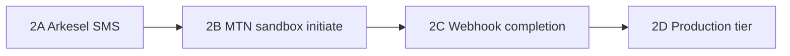

# Phase 2 — Real SMS (Arkesel) & MTN MoMo Sandbox

**Goal:** Move staging from console OTP + mock MoMo to real provider integrations, without jumping straight to production money.

**Staging API (current):** `https://myturn-webportal-staging.up.railway.app/api`  
**Web:** `https://myturn-webportal-web-portal.vercel.app`

Phase 1 (mock/console) can stay running in parallel until each step below is verified.

---

## What you need before changing Railway

| Provider | Where to get credentials | MyTurn env vars |
|----------|-------------------------|-----------------|
| **Arkesel SMS** | [Arkesel](https://arkesel.com) dashboard — API key + approved **Sender ID** | `SMS_PROVIDER=arkesel`, `ARKESEL_API_KEY`, `ARKESEL_SENDER_ID` |
| **MTN MoMo sandbox** | [MoMo Developer Portal](https://momodeveloper.mtn.com) — Collection product, sandbox keys | `PAYMENT_PROVIDER=mtn-momo`, `MTN_MOMO_*` |

Keep `REDIS_URL` on Railway — OTP rate limits and idempotency expect Redis in staging.

---

## Recommended order



Do **2A first** — it does not require a new mobile APK (API-only change + redeploy).

---

## 2A — Enable Arkesel on Railway staging

### 1. Set variables (API service)

```env
SMS_PROVIDER=arkesel
ARKESEL_API_KEY=<from Arkesel dashboard>
ARKESEL_SENDER_ID=MyTurn
# optional:
# ARKESEL_BASE_URL=https://sms.arkesel.com/api/v2/sms/send
# ARKESEL_TIMEOUT_MS=12000
```

Leave `MOCK_PAYMENTS=true` and `PAYMENT_PROVIDER=mock` for now.

### 2. Redeploy the API service

Wait until deploy is healthy.

### 3. Verify

```bash
# Health — sms.provider should be arkesel, sms.health ok
curl -s https://myturn-webportal-staging.up.railway.app/api/health

# OTP flow (uses your phone; sends real SMS)
STAGING_API_URL=https://myturn-webportal-staging.up.railway.app/api npm run test:otp
```

On mobile: sign in with a **real Ghana number you control**. You should receive SMS only — **on-screen staging codes are disabled** when `SMS_PROVIDER=arkesel` (redeploy required after this change).

### SMS not arriving (troubleshooting)

| Check | Action |
|-------|--------|
| **Arkesel balance** | Dashboard → wallet/credits (402 = insufficient balance) |
| **Sender ID** | Must be **approved/active** — 403 often means inactive gateway |
| **Phone format** | Use Ghana mobile `024…` or `23324…` — API normalizes to `233…` |
| **Delivery logs** | Arkesel dashboard → SMS history for your number |
| **API errors** | Railway API logs → `arkesel.failed` or `otp.request.failure` |
| **Debug on screen** | Set `OTP_DEBUG_IN_RESPONSES=true` only while debugging (not for testers) |

If the API returns “Unable to send verification code”, Arkesel rejected the send (invalid number, balance, or sender). If the request succeeds but SMS is delayed, wait 1–2 minutes or check spam/filtering on the handset.

### 4. Rollback

```env
SMS_PROVIDER=console
```

Redeploy.

---

## 2B — Enable MTN MoMo sandbox (initiate real prompts)

### 1. Set variables (API service)

```env
PAYMENT_PROVIDER=mtn-momo
MTN_MOMO_ENVIRONMENT=sandbox
MTN_MOMO_TARGET_ENV=sandbox
MTN_MOMO_SUBSCRIPTION_KEY=<collection subscription key>
MTN_MOMO_API_USER=<sandbox API user UUID>
MTN_MOMO_API_KEY=<sandbox API key>
# MTN_MOMO_API_SECRET=   # if your portal issues one
MTN_MOMO_CALLBACK_HOST=https://myturn-webportal-staging.up.railway.app
```

`MTN_MOMO_CALLBACK_HOST` is the **public Railway host only** (no `/api` suffix). The API registers callbacks at `{host}/api/webhooks/mtn` automatically.

After deploy, **mobile polls** pending payments and **webhooks** can mark them approved — you do not need “Simulate MoMo” when `PAYMENT_PROVIDER=mtn-momo` (keep `MOCK_PAYMENTS=true` only if you still want admin mock record + simulate button).

Optional webhook signing:

```env
WEBHOOK_SECRET_MTN=<long random string>
```

### 2. Staging payment mode (choose one)

| Mode | `MOCK_PAYMENTS` | Member experience | Admin web “Record” mock pay |
|------|-----------------|-------------------|----------------------------|
| **Hybrid (recommended first)** | `true` (default) | Real MoMo **request** may fire; **Simulate MoMo approval** still works | Still works |
| **Sandbox-only** | `false` | User must approve on phone; no mock-approve button | **Disabled** |

Start with **hybrid** so payment testing does not break while webhooks are wired.

### 3. Redeploy and verify health

```json
"infrastructure": {
  "payment": { "provider": "mtn-momo-sandbox", "health": "ok" }
}
```

### 4. Test on device

1. Sign in as seeded payment tester (`0240000001`) or your account in **Staging Payments Lab** / `STAGING-PAY`.  
2. Start **Pay via MoMo** — check Railway logs for `mtn.requesttopay`.  
3. Approve on the **sandbox test wallet** (MTN developer docs).  
4. If hybrid: still use **Simulate MoMo approval** until 2C is done.

### 5. Rollback

```env
PAYMENT_PROVIDER=mock
```

Redeploy.

---

## 2C — Webhook + poll settlement (shipped in repo)

- `POST /api/webhooks/mtn` → settles `PaymentRequest` when MTN reports **SUCCESSFUL**  
- Mobile **polls** `GET payment-request` while pending → calls MTN verify API and settles  
- “Simulate MoMo approval” only shows when the API returns `mockApproveHint` (mock provider)

Optional: `ENABLE_RECONCILIATION_JOB=true` on staging for background drift checks.

---

## 2D — Production tier (later)

Only when Arkesel + MTN sandbox paths are stable:

```env
DEPLOYMENT_TIER=production
MOCK_PAYMENTS=false
MOCK_PAYOUTS=false
STAGING_RELAX_TRUST=false
MEMBER_PHONE_LOGIN=false
SMS_PROVIDER=arkesel
PAYMENT_PROVIDER=mtn-momo
```

Startup **will crash** if `SMS_PROVIDER=console`, `PAYMENT_PROVIDER=mock`, or `MOCK_PAYMENTS=true` — that is intentional.

Use a **separate** Railway service or project for production DB and secrets; do not flip production tier on the current staging DB without a migration plan.

---

## Client apps (no rebuild for 2A)

| Client | Phase 2 change |
|--------|----------------|
| **Web (Vercel)** | No change if `NEXT_PUBLIC_API_URL` already points at staging API |
| **Mobile APK** | No rebuild for Arkesel-only; rebuild if you change `EXPO_PUBLIC_API_URL` or payment UX flags |

---

## Quick reference — staging after Phase 2A only

```env
DEPLOYMENT_TIER=staging
SMS_PROVIDER=arkesel
ARKESEL_API_KEY=...
ARKESEL_SENDER_ID=...
PAYMENT_PROVIDER=mock
MOCK_PAYMENTS=true
REDIS_URL=${{ Redis.REDIS_URL }}
```

---

## Related docs

- [FINTECH_INFRASTRUCTURE_PHASE.md](./FINTECH_INFRASTRUCTURE_PHASE.md) — architecture already built in Phase 1  
- [RAILWAY_STAGING_SETUP.md](./RAILWAY_STAGING_SETUP.md) — Railway variables  
- [TESTER_RUNBOOK.md](./TESTER_RUNBOOK.md) — update tester FAQ when SMS goes live (“codes arrive by SMS, not on screen”)

---

## What I need from you to execute 2A on Railway

1. Arkesel **API key**  
2. Approved **Sender ID** (e.g. `MyTurn`)  
3. A **test phone number** you can receive SMS on  

Paste “ready for 2A” when those exist (do not paste secrets in chat — set them in Railway Variables yourself). We can then walk through redeploy + `npm run test:otp` together.
